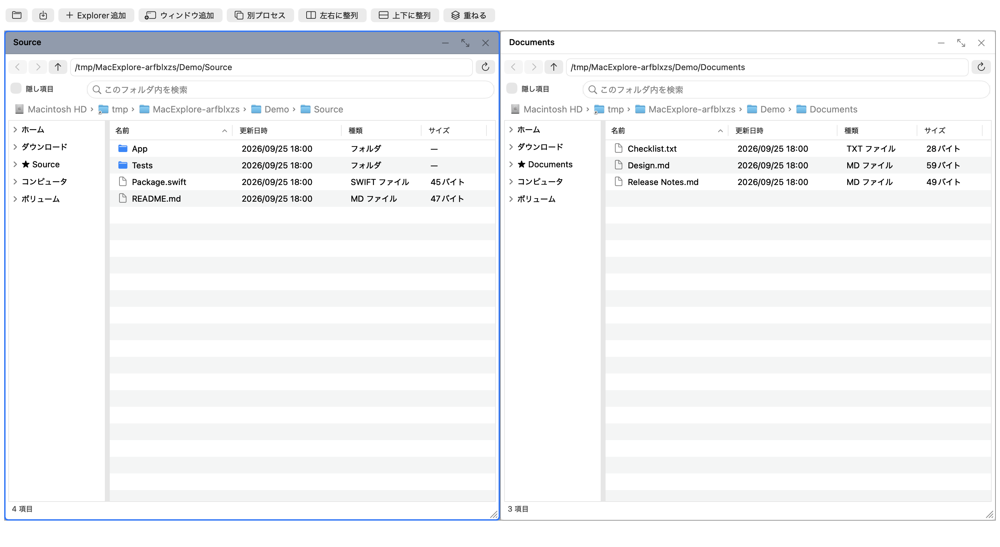
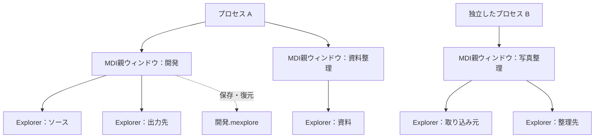

# Moooyooo Mac Explore

[English](README.md) · [多言語対応](docs/localization.md) · [P6の進捗](docs/p6-verification.md)

[](https://github.com/moooyooo/moooyooo-mac-explore/actions/workflows/ci.yml)

A lightweight native macOS file manager with Windows Explorer-inspired controls,
multiple MDI workspaces, independent app processes, and saved projects.

Windows Explorerの操作感を基本にした、軽量なmacOSネイティブファイラです。
ひとつの親ウィンドウ内に複数のExplorer画面を配置し、フォルダと画面配置を
プロジェクトとして保存・切り替えできることを目指します。

## 現在の状態

**閲覧・プロジェクト保存・セッション復旧・基本ファイル操作・署名付き更新に対応した、バージョン0.7.2の開発版です。**

複数のMDI親ウィンドウ、子画面の移動・サイズ変更・整列・最大化・最小化、
別プロセス起動に加え、フォルダツリー、パンくず、詳細一覧、パス入力、履歴、列ソート、
名前フィルター、隠し項目、お気に入り、外部変更の自動更新を実装しています。
表示メニューから並べ替え・列順／列幅・ツリー表示を設定でき、開けないフォルダでは
再試行・参照先選択を行えます。起動中のライト／ダーク切替にも背景と枠線が追従します。
`.mexplore`へフォルダ構成・配置・列設定を保存し、復元・切り替えができます。
同時起動時の保存権、外部変更の検出、プロセス別の復旧も実装しています。
フォルダ作成・名前変更・コピー・切り取り／貼り付け・ゴミ箱・限定したUndoを実装しました。
同名衝突の選択、進捗・取消、右クリックメニュー、ファイルURLのDnDも接続しています。
合成データの保全・AppKitの操作・専用APFSボリューム間の移動と実際の容量不足を検証しました。
Finder連携と物理的な外部ドライブ・ネットワークでの検証は残っています。
[ファイル操作の使い方と制約](docs/file-operations.md)を参照してください。
マウスでの実操作・IME・VoiceOver・最小対応OSでの手動確認も残っています。

異常終了したセッションから、各Explorerの選択・スクロール位置・戻る／進む履歴も復旧できます。
これらは個人用の復旧情報へ保存し、共有するプロジェクト形式はバージョン1を維持しています。
検証結果と制約は[P5の検証記録](docs/p5-verification.md)、[P2/P3の実装記録](docs/p2-p3-verification.md)、
初期の基準値は[P1の実装記録](docs/p1-verification.md)を参照してください。

## 自動アップデート

アプリメニューの「アップデートを確認」から確認できます。
「アップデートを自動確認」と「更新を自動ダウンロードして終了時にインストール」は
個別に有効化できます（初期設定は両方オフ）。起動中に1日1回確認します。
更新中の別プロセス起動と操作中の終了を制御し、画面構成を更新後に復元します。

更新者は引き続き **moooyooo** です。Sparkle 2.10.0を同梱し、
署名付き更新一覧とZIPを検証します。現在の公開フィードは空で、
署名・公証済みの配布版はまだありません。旧開発版からの初回導入は手動になります。
[更新の詳細・復旧・配布手順](docs/updates.md)を参照してください。

## 画面



合成ファイルを使った、実際のAppKitウィンドウ内容のキャプチャです。
[英語の画面](docs/images/workspace-en.png) · [撮影条件・再生成手順](docs/screenshots.md)

## プロジェクトについて

2026-09-25に初期仕様を整理しました。プロジェクト名は仮称です。
管理者・GitHubユーザー名は **[moooyooo](https://github.com/moooyooo)** です。
ソースは[moooyooo/moooyooo-mac-explore](https://github.com/moooyooo/moooyooo-mac-explore)で開発版として公開しています。

## 目指す使い方

1. 「開発」プロジェクトで、ソース・資料・出力先を別々のExplorer画面として開く。
2. 子画面を自由配置または整列し、プロジェクトを保存する。
3. 別のMDI親ウィンドウで「写真整理」プロジェクトを開く。
4. 必要に応じてアプリを**別プロセスでも起動**し、独立して作業する。
5. 次回、保存済みプロジェクトからフォルダと配置を復元する。



1プロジェクトは1つのMDI親ウィンドウの構成を保存します。
同じプロジェクトを別プロセスで開いた場合、後から開いた側はプロジェクト設定を
読み取り専用とし、無断で保存内容を上書きしない仕様です。

## 表示言語

日本語・英語に対応しました。初期状態ではmacOSの優先言語に従い、対応言語がなければ英語を使います。
アプリ名メニューの「言語 / Language」から選び、次回起動から反映します。
起動中の別プロセスと、保存済みのプロジェクト名・ファイル名には影響しません。
一時的に英語で開く場合は、起動引数 `--language en` を指定できます。

## キー操作の切り替え

アプリ名メニューの「キー操作」から「Explorer」「Mac」を選べます。
既定のExplorerはControl系とCommand系を併用します。MacはCommand系を中心とし、
Control系の文字編集をMacへ渡します。Ctrl+Tabによる子画面切り替えは共通です。
変更はその場で反映し、別プロセスは次に前面へ戻ったときに保存済み設定を読み込みます。
`--shortcuts mac` または `--shortcuts explorer` はそのプロセスだけに適用します。
VoiceOver使用中はControl+OptionとCaps Lockの組み合わせをVoiceOverへ渡します。

## 設計の軸

- Swift＋AppKitを採用。署名付き更新にSparkle 2.10.0を同梱。
- Explorer風のメニュー、フォルダツリー、詳細一覧、アドレスバーを備える。
- Windows系ショートカットを基本に、Command系操作も併用できるようにする。
- MDI子画面は移動・サイズ変更・最大化・最小化・整列に対応する。
- ファイル操作の安全性、キーボード操作、低い待機時負荷を重視する。
- 初期対象はApple Silicon、macOS 14以降を暫定基準とする。対応保証は実機検証後に確定する。

## 設計資料

| 資料 | 内容 |
| --- | --- |
| [要件定義](docs/requirements.md) | 必須機能、対象範囲、受け入れ条件、軽量化の目標 |
| [UX・ショートカット](docs/ux.md) | 画面構成、メニュー、キー操作、WindowsとMacの差異 |
| [アーキテクチャ](docs/architecture.md) | MDI、別プロセス起動、プロジェクト保存と排他制御 |
| [開発工程](docs/roadmap.md) | 段階ごとの成果物、検証、公開までの条件 |
| [プロジェクトの操作と形式](docs/projects.md) | 保存・切り替え・競合・復旧、JSON形式の上限 |
| [開発への参加](CONTRIBUTING.md) | 変更・検証・公開資料の扱い |

## 開発環境

Swift 6系とmacOS SDKが必要です。Command Line Toolsのみでもビルドできます。

```sh
git clone https://github.com/moooyooo/moooyooo-mac-explore.git
cd moooyooo-mac-explore
python3 scripts/check-localizations.py
scripts/build-app.sh release
scripts/test.sh --integration
open "build/Moooyooo Mac Explore.app"
```

`build/`にローカル用のad-hoc署名を付けた`.app`を生成します。
別プロセスでの起動は、アプリの「ファイル → 別プロセスで起動」から行えます。
ターミナルでは次のように起動できます。

```sh
open -n "build/Moooyooo Mac Explore.app" --args --folder "$PWD"
```

`--folder`を複数回指定すると複数の子画面を開きます。`--demo`は親2つ・各子3つを開きます。
保存済みプロジェクトは`--project /path/to/workspace.mexplore`、またはプロジェクトメニューから開けます。
アプリ生成後、`scripts/test.sh --integration`で実際の別プロセス起動・終了、
同じプロジェクトの保存権、AppKitの構成復元を検証できます。テスト用アプリは自動的に終了します。
通常のテストにも、独立したテスト用プロセスでのロック競合・強制終了試験が含まれます。

主なキー操作はCmd/Ctrl+N（子追加）、Cmd/Ctrl+Option+N（親追加）、
Ctrl+Tab（子切替）、Cmd/Ctrl+L（パス入力）、F5（更新）です。
Cmd/Ctrl+Oでプロジェクトを開き、Cmd/Ctrl+Sで保存、Cmd/Ctrl+Shift+Sで別名保存します。
子の右下をドラッグするとサイズを変更できます。キーボードではウィンドウメニューの
「子画面を移動」「サイズを変更」を選び、矢印・Enter・Escを使います。

`scripts/test.sh`は、一部のCommand Line Toolsで必要なSwift Testingの検索パスを補います。
Xcodeを選択している環境では通常のSwiftPM設定を利用します。

初期確認環境はmacOS 26.5 / Apple Silicon / Swift 6.3.2 / Command Line Toolsです。
現在選択されている開発者ディレクトリはCommand Line Toolsです。
0.7.1はGitHub ActionsのmacOS 14で実アプリ・Releaseビルド・アーカイブ検証に成功しました。
macOS 26では既知の終了試験の問題I-06が再発しています（[今回の検証結果](docs/releases/0.7.1.md)）。
実行状況は[GitHub Actions](https://github.com/moooyooo/moooyooo-mac-explore/actions/workflows/ci.yml)、
公開時の確認結果は[P6の記録](docs/p6-verification.md)を参照してください。

### Performance tools

合成データで列挙とソートの処理時間を測れます（画面描画は含みません）。

```sh
python3 scripts/create-fixture.py .local/fixtures/10000 --count 10000
swift run -c release BrowserBenchmark .local/fixtures/10000 10
scripts/benchmark-ui.sh
scripts/test-volumes.sh
```

`benchmark-ui.sh`はRelease版で一覧の描画・起動・メモリ・60秒の待機CPU・50回の子画面開閉を測定します。
`test-volumes.sh`は128 MiBの専用APFSイメージを作り、別ボリューム操作と実際の容量不足を検証して取り外します。
結果はGit管理外の`.local/`へ保存します。
`StorageProbe`と`BrowserBenchmark`は開発・検証用ツールで、配布用`.app`には入りません。
試験用の`--support-directory`は復旧情報・ロック・最近使った一覧の保存領域を隔離します。
通常起動では指定せず、同じプロジェクトを扱うプロセス同士では保存領域を統一してください。

## ライセンス・公開

ライセンスは[MIT](LICENSE)です。英語README・Issueテンプレート・配布スクリプトを追加しました。
指定により、多言語対応を先に実装してP6の公開準備を進めています。
日英・明暗の画面キャプチャと[0.7.2のリリースノート案](docs/releases/0.7.2.md)を用意しました。
Publicリポジトリでソースを公開し、非公開の脆弱性報告窓口を有効にしました。
一般配布に向けてI-06の解消、Developer ID署名・公証と実環境での手動確認が残っています。
作業の内訳とユーザー側で必要な対応は[TODO・ISSUE・ブロッカー](docs/backlog.md)にまとめています。
検証条件は[配布手順](docs/releasing.md)と[P6の記録](docs/p6-verification.md)を参照してください。
