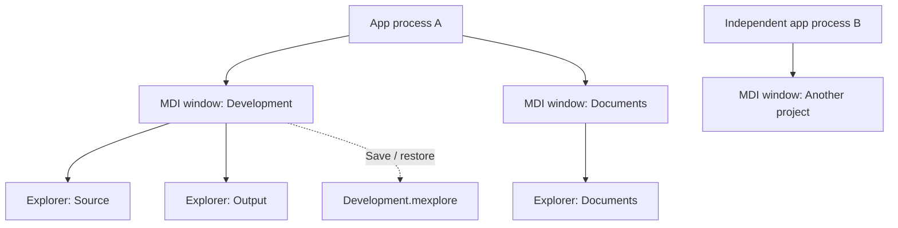

# Moooyooo Mac Explore

[日本語](README.ja.md) · [Changelog](CHANGELOG.md) · [Roadmap](docs/roadmap.en.md)

A lightweight native macOS file manager with Windows Explorer-inspired controls.
Arrange multiple Explorer panes inside an MDI window, keep several workspaces open,
launch independent app processes, and save each workspace as a project.

**0.3.0 development preview.** Browsing and project persistence are implemented.
File copy, move, rename, trash, drag-and-drop and file-operation Undo are planned.
There is no signed, notarized public release yet.

## Features

- Native Swift + AppKit UI, with no external runtime dependencies.
- Multiple MDI windows and movable/resizable Explorer panes; tile, cascade,
  maximize and minimize panes.
- Independent app processes, including opening a saved project in another process.
- Folder tree, breadcrumbs, details table, column sorting, navigation history,
  filename filtering, hidden items, favorites and automatic refresh.
- `.mexplore` projects preserve folders, pane arrangement, columns, filters and tree settings.
- Project editing locks, detection of outside changes, atomic saves and recovery
  of interrupted workspace configurations.
- English and Japanese menus, status messages, dialogs and accessibility labels.



One project describes one MDI window. Opening the same project in another window
or process makes the later instance's project layout read-only. Save a copy or
reload and acquire editing access after the existing owner closes it.

## Requirements

- macOS 14 or later is the deployment target; the minimum OS still needs validation.
- Apple Silicon is the initial target. Intel has not been qualified.
- Swift 6 and a macOS SDK, from Xcode or Command Line Tools.
- Python 3 for repository validation and synthetic fixtures.

Local verification uses macOS 26.5, Apple M2 Max and Swift 6.3.2 with Command Line
Tools. CI is configured for macOS 14 and 26, but has not run on GitHub yet.
Builds contain the host architecture, not a universal binary.

## Build and run

From the repository root:

```sh
python3 scripts/check-localizations.py
scripts/build-app.sh release
scripts/test.sh --integration
python3 scripts/verify-app.py
open "build/Moooyooo Mac Explore.app"
```

The build script produces an ad-hoc-signed app for local development and includes
translations and license notices. It does not contact Apple or publish anything.
`scripts/test.sh` also works without building the app; GUI integration tests are
then skipped. It supplies Swift Testing search paths when needed by Command Line Tools.

### Language

Choose **Moooyooo Mac Explore → Language / 言語 → English / 日本語 / Follow System**.
The change applies on the next launch; open windows keep their current language.
Initially, the app follows macOS preferred languages with English as the fallback.
File and saved project names remain unchanged.

For a separate English instance without changing the saved preference:

```sh
open -n "build/Moooyooo Mac Explore.app" --args --language en --folder "$PWD"
```

See [localization](docs/localization.md) for override precedence and translation work.

### Projects and multiple processes

Use **Project → Open Project**, **Save Project** and **Save As**.
Use **File → Launch New Process** for an independent instance.

```sh
open -n "build/Moooyooo Mac Explore.app" --args --project /path/to/workspace.mexplore
```

Repeat `--folder` to open several panes. `--demo` opens two windows with three panes
each. [Generate a synthetic sample](examples/README.md) for a clean two-pane workspace.
Screenshots will be added after English UI visual verification.

### Common shortcuts

| Action | Shortcut |
| --- | --- |
| New Explorer | Cmd/Ctrl+N |
| New MDI window | Cmd/Ctrl+Option+N |
| Close Explorer / MDI window | Cmd/Ctrl+W / Cmd/Ctrl+Shift+W |
| Next / previous Explorer | Ctrl+Tab / Ctrl+Shift+Tab |
| Enter path / filter names | Cmd/Ctrl+L / Cmd/Ctrl+F |
| Back / forward / parent | Option+Left / Right / Up |
| Refresh | F5 or Cmd+R |
| Open / save project | Cmd/Ctrl+O / Cmd/Ctrl+S |
| Save project as | Cmd/Ctrl+Shift+S |

Use the Window menu for keyboard movement and resizing, then arrows, Enter or Esc.
Edit-menu clipboard commands currently apply to text fields; file operations are
not implemented. macOS menu-bar focus is Control+F2 (or Fn+Control+F2).

## Verification and limitations

Tests cover layout and focus routing, Unicode names, project validation, save failure
injection, real process locks and crash recovery, shared watcher cleanup, AppKit state
restoration and both languages in a relocated packaged app.

Manual mouse/keyboard, IME, VoiceOver, display scaling and native panel checks remain
open. Recovery restores workspace configurations; selections, scroll positions and
navigation history are not yet restored. Minimum-OS and Intel verification, full UI
performance measurements, Developer ID signing, notarization and first-download
testing remain release gates. See the [P6 status](docs/p6-verification.md).

For performance experiments using generated files:

```sh
python3 scripts/create-fixture.py .local/fixtures/10000 --count 10000
swift run -c release BrowserBenchmark .local/fixtures/10000 10
```

`StorageProbe` and `BrowserBenchmark` are not bundled in the app.
`--support-directory` isolates test recovery, locks and recent-project records;
processes editing the same project must use the same support directory.

## Contributing and releases

- [Contributing](CONTRIBUTING.md), [security reporting](SECURITY.md)
- [Release preparation and packaging](docs/releasing.md)
- [Requirements](docs/requirements.md), [UX](docs/ux.md), [architecture](docs/architecture.md),
  [project format](docs/projects.md) (detailed design documents currently in Japanese)
- [Asset and dependency provenance](THIRD_PARTY_NOTICES.md)

Maintainer: [moooyooo](https://github.com/moooyooo). License: [MIT](LICENSE).
The name is provisional. Windows Explorer is a UX reference; this project is not
affiliated with Microsoft or Apple.
