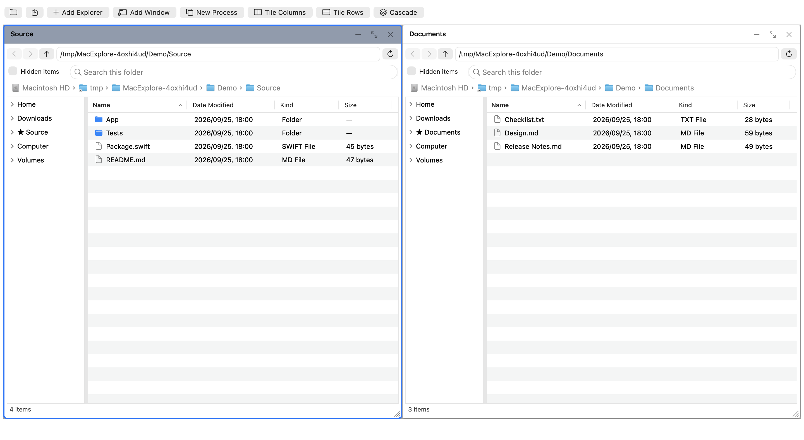
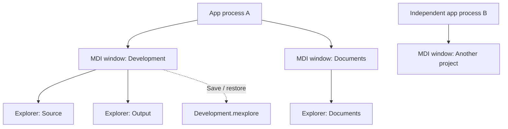

# Moooyooo Mac Explore

[日本語](README.ja.md) · [Changelog](CHANGELOG.md) · [Roadmap](docs/roadmap.en.md)

[](https://github.com/moooyooo/moooyooo-mac-explore/actions/workflows/ci.yml)

A lightweight native macOS file manager with Windows Explorer-inspired controls.
Arrange multiple Explorer panes inside an MDI window, keep several workspaces open,
launch independent app processes, and save each workspace as a project.

**0.7.1 development preview.** Browsing, projects, session recovery, basic file operations and signed update support are implemented.
File operations have synthetic-data, native AppKit and separate APFS volume tests;
manual/Finder and physical removable/network-drive qualification remain open.
See [file operations and limits](docs/file-operations.md).
There is no signed, notarized public release yet.

## Screenshot



Actual AppKit window content with synthetic files, captured in English and Japanese.
[Japanese image](docs/images/workspace-ja.png) · [Capture details and reproduction](docs/screenshots.md)

## Features

- Native Swift + AppKit UI; Sparkle 2 handles signed in-app updates.
- Multiple MDI windows and movable/resizable Explorer panes; tile, cascade,
  maximize and minimize panes.
- Independent app processes, including opening a saved project in another process.
- Folder tree, breadcrumbs, details table, column sorting, navigation history,
  filename filtering, hidden items, favorites and automatic refresh.
- View menus for sorting, column order/width and navigation visibility; per-pane
  retry/folder selection when a location cannot be opened; live light/dark updates.
- `.mexplore` projects preserve folders, pane arrangement, columns, filters and tree settings.
- Project editing locks, detection of outside changes, atomic saves and recovery
  of interrupted workspaces, including selection, viewport and navigation history.
- English and Japanese menus, status messages, dialogs and accessibility labels.
- Explorer and Mac keyboard presets, selectable from the app menu.
- Create folders, rename, copy/cut/paste, move to Trash, resolve conflicts and undo
  supported operations. Native file URL drag-and-drop is connected.



One project describes one MDI window. Opening the same project in another window
or process makes the later instance's project layout read-only. Save a copy or
reload and acquire editing access after the existing owner closes it.

## Requirements

- macOS 14 or later is the deployment target; manual minimum-OS qualification remains open.
- Apple Silicon is the initial target. Intel has not been qualified.
- Swift 6 and a macOS SDK, from Xcode or Command Line Tools.
- Python 3 for repository validation and synthetic fixtures.

Local verification uses macOS 26.5, Apple M2 Max and Swift 6.3.2 with Command Line
Tools. For 0.7.1, hosted macOS 14 builds, automated tests and archive verification pass;
the existing two-process termination issue I-06 recurred on macOS 26.
See the [current release verification](docs/releases/0.7.1.md).
See the [workflow results](https://github.com/moooyooo/moooyooo-mac-explore/actions/workflows/ci.yml)
and [publication verification](docs/p6-verification.md) for tested versions and scope.
Builds contain the host architecture, not a universal binary.

## Build and run

Clone the source, then run from the repository root:

```sh
git clone https://github.com/moooyooo/moooyooo-mac-explore.git
cd moooyooo-mac-explore
python3 scripts/check-localizations.py
scripts/build-app.sh release
scripts/test.sh --integration
python3 scripts/verify-app.py
open "build/Moooyooo Mac Explore.app"
```

The build script produces an ad-hoc-signed app for local development and includes
translations and license notices. It does not contact Apple or publish anything.
`scripts/test.sh` also works without building the app; GUI integration tests are
then skipped. It supplies Swift Testing search paths when needed by Command Line Tools.

### Language

Choose **Moooyooo Mac Explore → Language / 言語 → English / 日本語 / Follow System**.
The change applies on the next launch; open windows keep their current language.
Initially, the app follows macOS preferred languages with English as the fallback.
File and saved project names remain unchanged.

For a separate English instance without changing the saved preference:

```sh
open -n "build/Moooyooo Mac Explore.app" --args --language en --folder "$PWD"
```

See [localization](docs/localization.md) for override precedence and translation work.

### Updates

Use **Moooyooo Mac Explore → Check for Updates**. Automatic daily checks and
automatic download/install on quit are separate opt-in menu settings.
Only moooyooo-signed feeds and archives are accepted. File operations and other
processes defer updates; open workspaces are restored after installation.
The signed public feed is currently empty: no notarized binary has been released.
Install the first updater-enabled release manually; older previews cannot update themselves.
See [update behavior, recovery and publishing](docs/updates.md).

### Keyboard controls

Choose **Moooyooo Mac Explore → Keyboard Controls → Explorer / Mac**.
Explorer is the default and accepts Control and Command shortcuts. Mac uses
Command shortcuts and leaves native Control text editing available; Control+Tab
still cycles panes in both presets. The change takes effect immediately in this
process. Other instances read the saved choice when activated.
`--shortcuts mac` or `--shortcuts explorer` overrides it for one process.
With VoiceOver running, its Control+Option and Caps Lock combinations are passed through.

### Projects and multiple processes

Use **Project → Open Project**, **Save Project** and **Save As**.
Use **File → Launch New Process** for an independent instance.

```sh
open -n "build/Moooyooo Mac Explore.app" --args --project /path/to/workspace.mexplore
```

Repeat `--folder` to open several panes. `--demo` opens two windows with three panes
each. [Generate a synthetic sample](examples/README.md) for a clean two-pane workspace.

### Common shortcuts

| Action | Shortcut |
| --- | --- |
| New Explorer | Cmd/Ctrl+N |
| New MDI window | Cmd/Ctrl+Option+N |
| Close Explorer / MDI window | Cmd/Ctrl+W / Cmd/Ctrl+Shift+W |
| Next / previous Explorer | Ctrl+Tab / Ctrl+Shift+Tab |
| Enter path / filter names | Cmd/Ctrl+L / Cmd/Ctrl+F |
| Back / forward / parent | Option+Left / Right / Up |
| Refresh | F5 or Cmd+R |
| Open / save project | Cmd/Ctrl+O / Cmd/Ctrl+S |
| Save project as | Cmd/Ctrl+Shift+S |

Use the Window menu for keyboard movement and resizing, then arrows, Enter or Esc.
Create folders with Cmd/Ctrl+Shift+N; rename with F2; use Cmd/Ctrl+C/X/V/Z for
file copy/cut/paste/Undo. Delete→ or Cmd+Backspace moves selected items to Trash.
Text fields retain text-editing commands. macOS menu-bar focus is Control+F2
(or Fn+Control+F2).

## Verification and limitations

Tests cover layout and focus routing, Unicode names, project validation, save failure
injection, real process locks and crash recovery, shared watcher cleanup, AppKit state
restoration and both languages in a relocated packaged app.

Recovery includes each pane's selection, viewport and back/forward history in
private session files. Shared project schema version 1 is unchanged.
Manual mouse/keyboard, IME, VoiceOver, display scaling and native panel checks remain
open. Manual minimum-OS and Intel verification, Developer ID signing, notarization and
first-download testing remain release gates. See [performance qualification](docs/p5-verification.md)
and the [P6 status](docs/p6-verification.md).

For performance experiments using generated files:

```sh
python3 scripts/create-fixture.py .local/fixtures/10000 --count 10000
swift run -c release BrowserBenchmark .local/fixtures/10000 10
scripts/benchmark-ui.sh
scripts/test-volumes.sh
```

`benchmark-ui.sh` builds Release and measures native table display, startup, memory,
60-second idle CPU and 50 pane open/close cycles. Reports are kept under ignored
`.local/`. `test-volumes.sh` creates its own 128 MiB APFS image to test cross-volume
operations and real disk-full failures, then detaches it.
`StorageProbe`, `UpdateProbe` and `BrowserBenchmark` are not bundled in the app.
`--support-directory` isolates test recovery, locks and recent-project records;
processes editing the same project must use the same support directory.

## Contributing and releases

- [Contributing](CONTRIBUTING.md), [security reporting](SECURITY.md)
- [Release preparation and packaging](docs/releasing.md)
- [0.7.1 development release notes](docs/releases/0.7.1.md)
- [Current TODOs, issues and maintainer actions](docs/backlog.md)
- [Requirements](docs/requirements.md), [UX](docs/ux.md), [architecture](docs/architecture.md),
  [project format](docs/projects.md) (detailed design documents currently in Japanese)
- [Asset and dependency provenance](THIRD_PARTY_NOTICES.md)

Maintainer: [moooyooo](https://github.com/moooyooo). License: [MIT](LICENSE).
The name is provisional. Windows Explorer is a UX reference; this project is not
affiliated with Microsoft or Apple.
