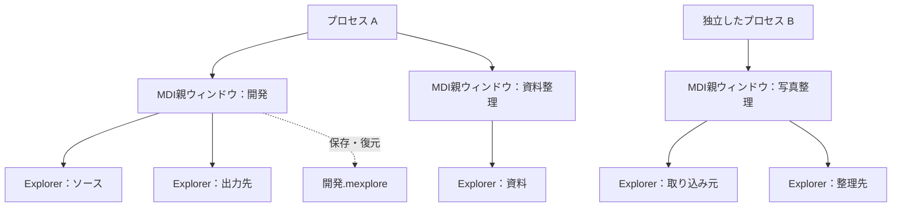

# Moooyooo Mac Explore

A lightweight native macOS file manager with Windows Explorer-inspired controls,
multiple MDI workspaces, independent app processes, and saved projects.

Windows Explorerの操作感を基本にした、軽量なmacOSネイティブファイラです。
ひとつの親ウィンドウ内に複数のExplorer画面を配置し、フォルダと画面配置を
プロジェクトとして保存・切り替えできることを目指します。

## 現在の状態

**P1のネイティブアプリ試作を実装しました。現在は閲覧用の開発版です。**

複数のMDI親ウィンドウ、子画面の移動・サイズ変更・整列・最大化・最小化、
別プロセス起動を実装しています。フォルダ一覧、パス入力、履歴、列ソート、名前フィルター、
隠し項目切替も使える構成です。プロジェクト保存とファイルの書き換え操作は今後の工程です。
実機での画面操作・VoiceOver・最小対応OSの検証は残っています。

検証結果と制約は[P1の実装記録](docs/p1-verification.md)を参照してください。

2026-09-25に初期仕様を整理しました。プロジェクト名は仮称です。
管理者・GitHubユーザー名は **[moooyooo](https://github.com/moooyooo)** です。
GitHubへの公開は今後の工程に含みます。

## 目指す使い方

1. 「開発」プロジェクトで、ソース・資料・出力先を別々のExplorer画面として開く。
2. 子画面を自由配置または整列し、プロジェクトを保存する。
3. 別のMDI親ウィンドウで「写真整理」プロジェクトを開く。
4. 必要に応じてアプリを**別プロセスでも起動**し、独立して作業する。
5. 次回、保存済みプロジェクトからフォルダと配置を復元する。



1プロジェクトは1つのMDI親ウィンドウの構成を保存します。
同じプロジェクトを別プロセスで開いた場合、後から開いた側はプロジェクト設定を
読み取り専用とし、無断で保存内容を上書きしない仕様です。

## 設計の軸

- Swift＋AppKitを採用。実行時の外部依存はゼロ。
- Explorer風のメニュー、フォルダツリー、詳細一覧、アドレスバーを備える。
- Windows系ショートカットを基本に、Command系操作も併用できるようにする。
- MDI子画面は移動・サイズ変更・最大化・最小化・整列に対応する。
- ファイル操作の安全性、キーボード操作、低い待機時負荷を重視する。
- 初期対象はApple Silicon、macOS 14以降を暫定基準とする。対応保証は実機検証後に確定する。

## 設計資料

| 資料 | 内容 |
| --- | --- |
| [要件定義](docs/requirements.md) | 必須機能、対象範囲、受け入れ条件、軽量化の目標 |
| [UX・ショートカット](docs/ux.md) | 画面構成、メニュー、キー操作、WindowsとMacの差異 |
| [アーキテクチャ](docs/architecture.md) | MDI、別プロセス起動、プロジェクト保存と排他制御 |
| [開発工程](docs/roadmap.md) | 段階ごとの成果物、検証、公開までの条件 |
| [開発への参加](CONTRIBUTING.md) | 変更・検証・公開資料の扱い |

## 開発環境

Swift 6系とmacOS SDKが必要です。Command Line Toolsのみでもビルドできます。

```sh
scripts/test.sh
scripts/build-app.sh release
open "build/Moooyooo Mac Explore.app"
```

`build/`にローカル用のad-hoc署名を付けた`.app`を生成します。
別プロセスでの起動は、アプリの「ファイル → 別プロセスで起動」から行えます。
ターミナルでは次のように起動できます。

```sh
open -n "build/Moooyooo Mac Explore.app" --args --folder "$PWD"
```

`--folder`を複数回指定すると複数の子画面を開きます。`--demo`は親2つ・各子3つを開きます。
アプリ生成後、`scripts/test.sh --integration`で実際の別プロセス起動・終了を検証できます。
テスト用アプリは自動的に終了します。

主なキー操作はCmd/Ctrl+N（子追加）、Cmd/Ctrl+Option+N（親追加）、
Ctrl+Tab（子切替）、Cmd/Ctrl+L（パス入力）、F5（更新）です。
子の右下をドラッグするとサイズを変更できます。キーボードではウィンドウメニューの
「子画面を移動」「サイズを変更」を選び、矢印・Enter・Escを使います。

`scripts/test.sh`は、一部のCommand Line Toolsで必要なSwift Testingの検索パスを補います。
Xcodeを選択している環境では通常のSwiftPM設定を利用します。

初期確認環境はmacOS 26.5 / Apple Silicon / Swift 6.3.2 / Command Line Toolsです。
現在選択されている開発者ディレクトリはCommand Line Toolsです。
GitHub Actions用にmacOSでのテスト・Releaseビルドを定義しています。
GitHubへまだpushしていないため、CI上での結果は未確認です。

## ライセンス・公開

ライセンスは未選定です。ソース公開前にライセンスを決定し、`LICENSE`を追加します。
公開版では再現可能なビルド手順、テスト、英語の案内、既知の制限、配布手順を整備します。
Windows ExplorerはUXの参照対象であり、製品の名称・画像・アイコンは独自に整備します。
