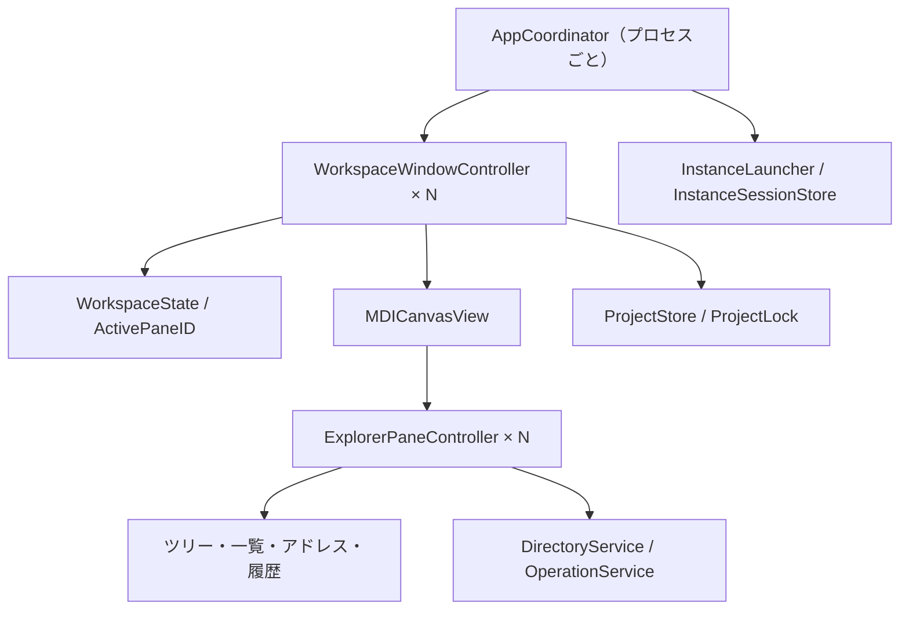

# アーキテクチャ方針

更新日: 2026-09-25 / 状態: P1の土台を実装、保存以降は設計段階

実装・検証の現状は[P1の記録](p1-verification.md)を参照。
以下のうちプロジェクト形式、排他、復旧、ファイル書込みは今後の実装方針である。

## 1. 技術選定

Swift 6系、AppKit、Foundationを軸とする。ファイル一覧は`NSTableView`、
階層表示は`NSOutlineView`、親は`NSWindow`と`NSWindowController`で構成する。
`NSOutlineView`は必要なデータをデータソースから取得できるため、ツリーの遅延読込に利用する。
参考: [Apple NSOutlineView](https://developer.apple.com/documentation/appkit/nsoutlineview)。

初期の実行時外部依存はゼロを目標にする。UI構造・キーボード・表示更新を直接制御する
必要性からAppKitを選ぶ。軽量さそのものはフレームワーク名で保証せず、P1とP5で測る。
純粋なモデル・配置計算・保存処理をUIから分離してSwift Packageでテストする。

最初はSwift Packageで実行ファイルとテストを管理し、スクリプトでInfo.plist・リソースを
含む`.app`を生成する。P1でビルド・起動・別プロセス起動を再現する。
XcodeのUI自動テスト用ターゲットは必要な工程で追加する。

初期識別子案:

| 項目 | 値 |
| --- | --- |
| 表示名 | Moooyooo Mac Explore（仮称） |
| モジュール／実行ファイル | MacExplore |
| Bundle ID | io.github.moooyooo.MacExplore |
| プロジェクト拡張子 | `.mexplore` |
| プロジェクトUTType | io.github.moooyooo.macexplore.project |

## 2. MDIの実装方法

AppKitの`addChildWindow`は別々のウィンドウの移動・重なり順を関連付けるAPIである。
この動作から、今回の親内部でクリップされるMDIには、`NSView`のコンテナと子の
`NSViewController`を使う設計とする。これは本プロジェクトの設計判断であり、MDI動作は
実装検証が必要である。
参考: [Apple addChildWindow](https://developer.apple.com/documentation/appkit/nswindow/addchildwindow(_:ordered:))。



子のタイトル・操作ボタン・リサイズ領域・重なり順・最大化前の枠を独自管理する。
子を切り替える際にfirst responderを更新し、メニューはアクティブな親のコマンド経路へ渡す。
OSによる親ウィンドウの自動タブ化は抑止し、MDIの階層が分かる形を維持する。

子の通常時の枠はキャンバスに対する0〜1の相対座標、左上原点で保持する。
最大化中も通常枠を別に残す。整列は同じモデルから計算し、ドラッグとキーボード操作の
両方で使う。復元時は画面サイズと最小寸法を考慮し、タイトルと閉じる操作が隠れないよう補正する。
最小化した子は親内の一覧から戻す。親の画面位置は画面識別情報とpointsで保持し、
ディスプレイがなくなった場合は現在の画面内へ補正する。

P1で複数親・合計6子、重なり、フォーカス、アクセシビリティ、親のリサイズを検証する。
成立しない箇所があれば、計測結果と必要な代替案を開発工程へ記録する。

## 3. 別プロセス起動

アプリ内の「別プロセスで起動」は、現在のアプリのURLと
`NSWorkspace.OpenConfiguration.createsNewApplicationInstance = true`を使う。
Appleはこの設定で既存アプリがあっても新しいインスタンスを起動すると説明している。
参考: [Apple OpenConfiguration](https://developer.apple.com/documentation/appkit/nsworkspace/openconfiguration)。

`.app`を使った検証にはmacOSの`open -n`も利用する。起動対象は現在のアプリの実体に固定し、
同じBundle IDを持つ別ビルドに誤って引き継がないことをP1で確認する。
引数やopen-documentイベントの重複受信でプロジェクトを二重に開かないようにする。

各プロセスは起動時に`instanceID`（UUID）を生成し、親・子の状態とファイル操作キューを所有する。
常駐デーモンやプロセス間のUI同期は導入しない。新規の別プロセスは空のワークスペース、
または指定されたプロジェクトから開始し、他の実行中インスタンスのセッションを自動復元しない。
Cmd+Qは現在のプロセスに作用する。

共有設定はキー単位の小さな設定として保存する。最近使ったプロジェクト一覧は
短時間の排他下で再読込・マージ・原子的保存を行う。プロセス起動時の古い一覧で上書きしない。
異常終了からの復旧は、所有プロセスが生存していないセッションをユーザーが選んで開く。
PIDだけで生存や所有権を判定しない。

## 4. モデルとプロジェクト形式

`Project` → `WorkspaceState` → `[ExplorerPaneState]`という所有関係にする。
永続モデルは`Codable`とし、`NSWindow`や`NSView`そのものを保存しない。
Appleも`NSWindow`の直接アーカイブではなく状態復元用の仕組みを案内している。
参考: [Apple NSWindow](https://developer.apple.com/documentation/appkit/nswindow)。

UTF-8のJSON形式を採用予定。最終スキーマと検証器はP3で追加する。

| 情報 | 主なフィールド案 |
| --- | --- |
| ヘッダー | `schemaVersion`, `projectID`, `name`, `revision` |
| 親 | 画面位置、サイズ、レイアウトモード、`activePaneID` |
| 子 | `paneID`、フォルダ参照、通常枠、最大化／最小化、列、ソート、ツリー、フィルター |
| 重なり順 | 子配列を背面→前面の順に記録 |
| 場所参照 | file URL、補助的なbookmark、表示用の名前 |

bookmarkは移動された場所を解決する補助情報として扱い、失効時は再生成、
解決不能ならユーザーに場所の選び直しを提供する。アクセス権限が必ず復元されるとは扱わない。
参考: [Apple bookmarkの解決](https://developer.apple.com/documentation/foundation/nsurl/init(resolvingbookmarkdata:options:relativeto:bookmarkdataisstale:))。

未知の`schemaVersion`では書き戻しを拒否する。移行が必要な場合は元を保全してから行う。
UUID重複、存在しない`activePaneID`、非有限の座標、範囲外の枠、巨大な入力、
file以外のURLを検証する。件数・サイズ上限はP3の実測と形式定義で固定する。
プロジェクトにはシェルコマンド、スクリプト、起動時ファイル操作の機能を設けない。

プロジェクトは参照先のパスを含むため、公開サンプルは架空のディレクトリとデータで作る。
bookmarksや個人のセッションはサンプルへ含めない。

## 5. 保存と同時起動の整合性

### プロジェクトの編集権

同じプロセス内で同じプロジェクトを開く場合は既存の親へ移動する。
別プロセスで同じプロジェクトを開く場合は、OSのアドバイザリロックを使い、
編集権を持つプロセスを1つにする。初期対象はローカルのプロジェクトファイルである。

ロックは保存時に置換されるプロジェクト本体のinodeへ直接付けず、正規化した保存先に対応する
専用ロックファイルで保持する。プロセス終了でOSが解放するロックを使い、
ロックファイルの存在だけで所有者を判定しない。保持中のロックファイルを削除・作り直さない。
参照パスの別表記・シンボリックリンクは同じ対象へ正規化する。ハードリンクされた
プロジェクトは初期版では直接書き換えず、独立した通常ファイルへの別名保存を案内する。

後から開いた側は構成を読み取り専用にする。「編集権を再取得」はロック取得後に
最新の内容を再読込し、ローカル変更があれば別名保存／破棄／取消を選べるようにする。
外部エディタや同期ソフトはこのロックに従うとは限らないため、保存前にも
読み込んだ版と現在の内容を比較し、外部変更を検出したら上書きを止める。
非協調的な他アプリとの競合を完全に防げる設計とはみなさない。

### 保存手順

1. 編集権・入力モデル・保存先の現在の版を確認する。
2. 保存先と同じボリュームの一時ファイルへ完全なJSONを書き、検証する。
3. 必要なフラッシュと原子的な置換を行い、成功時だけ`revision`と未保存状態を更新する。
4. 失敗時は元ファイルと未保存状態を維持し、エラーと再試行を表示する。

別名保存は新しい`projectID`を付け、移行先のロックを取得してから現在の関連付けを変える。
既存のプロジェクトを置き換える場合も衝突確認を行う。
ディスク容量不足、途中終了、破損、一斉起動・一斉保存をP3で検証する。

### セッション

復旧情報はApplication Support配下で`instanceID`ごとに保存する。
ファイル操作ログ、復旧スナップショット、設定、最近使った一覧は所有者と用途を分ける。
復旧スナップショットは明示保存したプロジェクトを勝手に更新せず、読取専用状態でも
別名保存できるようにする。所有中セッションの削除や他プロセスの復旧情報の上書きを防ぐ。

## 6. ファイルシステムと操作

`DirectoryService`はバックグラウンドで列挙し、画面ごとの世代IDで古い結果を破棄する。
`async`を付けるだけでI/Oがメインスレッドから外れるとはみなさず、実行するキューを明確にする。
ツリーは必要な階層のみ、アイコンは可視行から取得し、キャッシュの件数・容量を制限する。
監視は同一プロセス内で同じフォルダを共有し、イベントをまとめて差分更新する。
フォーカス復帰・F5・ボリューム再接続時にも整合性を確認する。

`OperationService`はファイルAPIを使い、実行計画・衝突判定・実行結果・Undo情報を管理する。
書込み先を排他的に確保し、処理直前に元と先の同一性・権限を再確認する。
同じアプリの別プロセスから同じ対象を変更する場合も短時間の操作ロックで調整する。
ロック取得順を一定にしてデッドロックを避け、外部アプリの変更時は停止・再確認する。

別ボリューム移動はコピー先の完成後に元を除去する。中途半端な出力を成功したファイルとして
扱わず、途中失敗で既存ファイルを消さない。シンボリックリンクはリンクそのものを操作し、
再帰処理で意図せずリンク先をたどらない。パッケージは既定で単一項目として扱う。
大小文字だけの名前変更、正規化の異なるUnicode、拡張属性をP4の対象に含める。

ゴミ箱は`FileManager.trashItem`を利用し、返された移動先をUndoの判定に使う。
参考: [Apple trashItem](https://developer.apple.com/documentation/foundation/filemanager/trashitem(at:resultingitemurl:))。
ファイルごとにキャンセルを確認し、途中までの成功と失敗を記録する。
Undo時も対象の同一性と変更有無を検証する。安全でないUndoは実行しない。

クリップボードは標準のfile URLを基本とする。アプリ間の切り取りには専用の型と一意な
移動要求IDを添え、受け側で排他的に消費する。送信元が終了しても、対象ファイルの状態と
消費済み記録を検証して二重移動を防ぐ。クリップボード内の値は信頼せず、移動の権限や
現在の項目を再確認する。プロトコルの詳細と異常終了時の試験はP4で固める。

## 7. 権限と配布

初期はGitHub等からの直接配布を想定し、非Sandboxの通常ユーザープロセスで検証する。
保護フォルダへのアクセスはmacOSの制約に従い、拒否された場所だけに案内を表示する。
将来Sandbox版を作る場合は、security-scoped bookmarkなどを別途検証する。

公開バイナリはDeveloper ID署名、Hardened Runtime、公証、ダウンロード後の起動確認を
工程に含める。ソース公開とバイナリ配布の条件は[開発工程](roadmap.md)に記載する。
参考: [Apple 配布準備](https://developer.apple.com/documentation/xcode/preparing-your-app-for-distribution)、
[Apple 公証](https://developer.apple.com/documentation/security/notarizing-macos-software-before-distribution)。

## 8. 将来のコード配置案

以下のディレクトリはP1以降で必要になった時点で追加する。

```text
Package.swift
Sources/
  MacExplore/          アプリ起動、メニュー、AppKitの画面
  ExplorerCore/        状態モデル、配置、履歴、操作の規則
  ExplorerPlatform/    ファイルアクセス、保存、ロック、別プロセス起動
Tests/                 モデル・保存・操作の試験と合成データ
Resources/             Info.plist、アイコン、ローカライズ
scripts/               ビルド、.app生成、測定
docs/                  要件、設計、操作・配布手順
```
